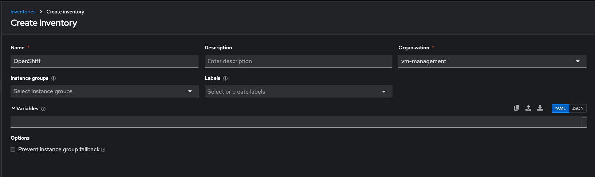

## Table of Contents
1. [Introduction](#introduction)
2. [Architecture Overview](#architecture-overview)
3. [Prerequisites](#prerequisites)
4. [Initial Setup](#initial-setup)
5. [AAP Configuration Steps](#aap-configuration-steps)
6. [Testing the Setup](#testing-the-setup)
7. [Next Steps](#next-steps)

## Introduction
This quick start guide provides step-by-step instructions for setting up Ansible Automation Platform (AAP) on OpenShift for virtual machine management. This guide serves as the entry point for the complete series and focuses on getting you up and running quickly.

> **Note**: This is a quick start guide. For detailed information about AAP architecture, components, and advanced configurations, refer to the subsequent parts in this series.

## Architecture Overview
The following diagrams illustrate the key components and their interactions in our AAP setup for VM management:

### Component Architecture

*Figure 1: High-level architecture of AAP components and their interactions*

### VM Management Flow

*Figure 2: Flow diagram showing VM lifecycle management process*

### Integration Points

*Figure 3: Integration points between AAP, OpenShift, and KubeVirt*

## Quick Start Overview
This guide will help you:
1. Set up AAP on OpenShift
2. Configure basic components
3. Create initial job templates
4. Start managing VMs

For a comprehensive understanding of AAP and VM management, follow the complete series starting with [Part 1: Foundation and Architecture](part1-foundation.md).

## Prerequisites
Before starting, ensure you have:
- Access to an OpenShift cluster
- OpenShift CLI (`oc`) installed
- Basic understanding of Ansible and KubeVirt
- Red Hat subscription for AAP 2.5
- To get password for `ansible-admin` user, run `oc get secret -n aap ansible-admin-password -o jsonpath='{.data.password}' | base64 --decode`
- Update AutomationHub Remotes and connections 
  - Navigate to -> `Automation Hub`
  - Click on -> `Remotes`
  - Click on Edit -> `rh-certified`
  - Update `Token` or `Username` and `Password`
  - Click on `Save Remote`
- Update Ansible Hub Repositories


## Initial Setup

### 1. Configure Execution Environment

#### A. Create Execution Environment Definition
Create `execution-environment.yml`:
```yaml
version: 3

images:
  base_image:
    name: registry.redhat.io/ansible-automation-platform-25/ee-minimal-rhel8:latest

dependencies:
  galaxy:
    collections:
      - kubernetes.core>=2.4.0
      - community.kubernetes>=2.0.0
      - operator_sdk.util>=0.3.0
      - redhat.openshift:4.0.1
      - redhat.openshift_virtualization>=1.0.0

  python:
    - kubernetes>=12.0.0
    - openshift>=0.12.0
    - jmespath>=1.0.0

  system:
    - python38
    - python38-pip
    - git

additional_build_steps:
  prepend_final:
    - RUN pip3 install --upgrade pip setuptools
  append_final:
    - RUN update-ca-trust
    - ENV KUBECONFIG=/etc/openshift/kubeconfig
    - ENV ANSIBLE_CONFIG=/etc/ansible/ansible.cfg
```

#### B. Build and Push Execution Environment
1. Install prerequisites:
```bash
# Install ansible-builder with specific version for AAP 2.5
pip3 install ansible-builder==3.0.0 --user

# Install podman (if not already installed)
sudo dnf install -y podman

# Login to registry
podman login registry.redhat.io
```

2. Build the execution environment:
```bash
# Create build context
mkdir -p ee-build
cp execution-environment.yml ee-build/

# Build the image
cd ee-build
ansible-builder build -t vm-management-ee:latest -v3 --prune-images
```

3. Verify the build:
```bash
# Check the image
podman images | grep vm-management-ee

# Test the image locally
podman run --rm vm-management-ee:latest ansible --version
podman run --rm vm-management-ee:latest ansible-galaxy collection list
```

4. Push to registry:
```bash
# Tag the image
podman tag vm-management-ee:latest quay.io/yourusername/vm-management-ee:latest

# Login to your registry
podman login quay.io

# Push the image
podman push quay.io/yourusername/vm-management-ee:latest
```

### Troubleshooting Execution Environment Builds

#### Common Issues and Solutions

1. **Collection Installation Errors**
   - Error: `Neither the collection requirement entry key 'name', nor 'source' point to a concrete resolvable collection artifact`
   - Solution: Update collection format in `execution-environment.yml`:
     ```yaml
     collections:
       - name: kubernetes.core
         version: ">=2.4.0"
         source: https://galaxy.ansible.com
     ```
   - Ensure you're logged into Red Hat registry:
     ```bash
     podman login registry.redhat.io
     ```
   - Configure Automation Hub token:
     ```bash
     ansible-galaxy collection list
     # Copy the token from Automation Hub UI
     ansible-galaxy collection install redhat.openshift --token <your-token>
     ```

2. **Build Process Troubleshooting**
   - Clean up previous build artifacts:
     ```bash
     rm -rf context/
     podman rmi vm-management-ee:latest
     ```
   - Enable verbose logging:
     ```bash
     ansible-builder build -t vm-management-ee:latest -v3 --prune-images
     ```
   - Check collection paths:
     ```bash
     podman run --rm vm-management-ee:latest ansible-config dump | grep COLLECTIONS_PATH
     ```

3. **Authentication Issues**
   - Verify Automation Hub configuration:
     ```bash
     cat ~/.ansible/galaxy_token
     ```
   - Test collection access:
     ```bash
     ansible-galaxy collection install redhat.openshift --force
     ```
   - Configure offline token if needed:
     ```bash
     ansible-galaxy collection install redhat.openshift_virtualization \
       --server https://console.redhat.com/ansible/automation-hub \
       --token <offline-token>
     ```

#### Build Verification Steps

1. Check the execution environment structure:
```bash
podman run --rm vm-management-ee:latest ls -la /usr/share/ansible/collections
```

2. Verify Python packages:
```bash
podman run --rm vm-management-ee:latest pip3 list
```

3. Test Ansible functionality:
```bash
podman run --rm vm-management-ee:latest ansible-playbook --version
```

#### Monitoring and Logging

1. Enable verbose logging during build:
```bash
ansible-builder build -t vm-management-ee:latest -v3 --prune-images
```

2. Check container logs:
```bash
podman logs -f $(podman ps -q --filter name=ansible-builder)
```

#### C. Configure in AAP
1. Navigate to Administration → Execution Environments
2. Click "Add"
3. Fill in:
   - Name: "vm-management-ee"
   - Image: "quay.io/yourusername/vm-management-ee:latest"
   - Pull Policy: "Always"
   - Description: "VM Management Execution Environment for OpenShift VM Management"
   - Organization: "Default"
4. Click "Save"

#### D. Test the Execution Environment
1. Create a test job template:
   - Name: "Test EE"
   - Job Type: "Run"
   - Inventory: "Demo Inventory"
   - Project: "vm-management"
   - Playbook: "test-ee.yml"
   - Execution Environment: "vm-management-ee"

2. Create a test playbook (`test-ee.yml`):
```yaml
---
- name: Test Execution Environment
  hosts: localhost
  gather_facts: false
  tasks:
    - name: Verify Python modules
      pip:
        name: kubernetes
        state: present
      check_mode: yes
      register: pip_check

    - name: Verify collections
      command: ansible-galaxy collection list
      register: collection_check

    - debug:
        var: pip_check

    - debug:
        var: collection_check.stdout_lines
```

3. Run the test job template and verify the output shows:
   - Required Python modules are available
   - Required collections are installed
   - No errors in execution

### 2. Create OpenShift Service Account
1. Create a new project for AAP:
```bash
oc new-project vm-testing
```

2. Create a service account:
```bash
oc create serviceaccount aap-sa -n aap
oc create serviceaccount aap-sa -n vm-testing 
```

3. Add necessary roles to the service account:
```bash
oc adm policy add-role-to-user admin -z aap-sa -n aap 
oc adm policy add-role-to-user admin -z aap-sa -n vm-testing 
```

4. Configure Credentials in AAP
* Navigate to -> `Infrastructure` -> `Credentials`
* Click on -> `Create Credential`
* Fill in the following:
  * Name: `kubevirt-credentials`
  * Credential Type: `OpenShift or Kubernetes API Bearer Token`
  * Kubernetes API Endpoint: `oc cluster-info`
  * Token: `oc create token aap-sa -n vm-testing`

5. Save the token for use in AAP credentials.

### 3. Configure project in AAP
* Fork [aap4ocpv](https://github.com/tosin2013/aap4ocpv) then point the SCM URL to your fork
* Navigate to -> `Projects`
* Click on -> `Create Project`
* Fill in the following:
  * Name: `vm-management`
  * SCM Type: `Git`
  * Execution Environment: `Default execution environment`
  * SCM URL: `https://github.com/tosin2013/aap4ocpv.git`
  * SCM Branch: `main`
  * Update Options: `Update on Launch`

### 4. Configure KubeVirt Inventory
Infrastructure -> Inventories -> Create Inventory
* Fill in the following:


* Click `Create Inventory`

Select `