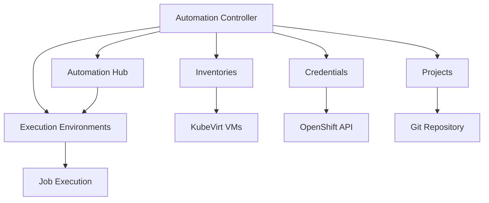
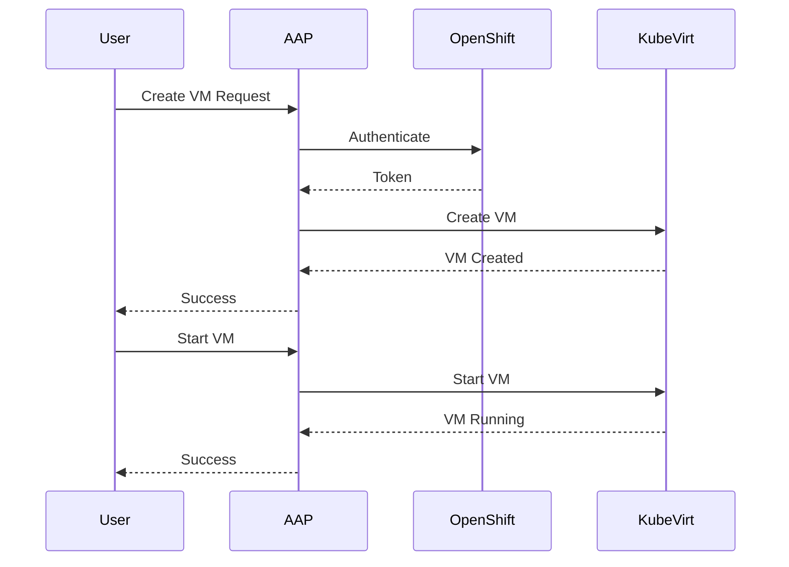
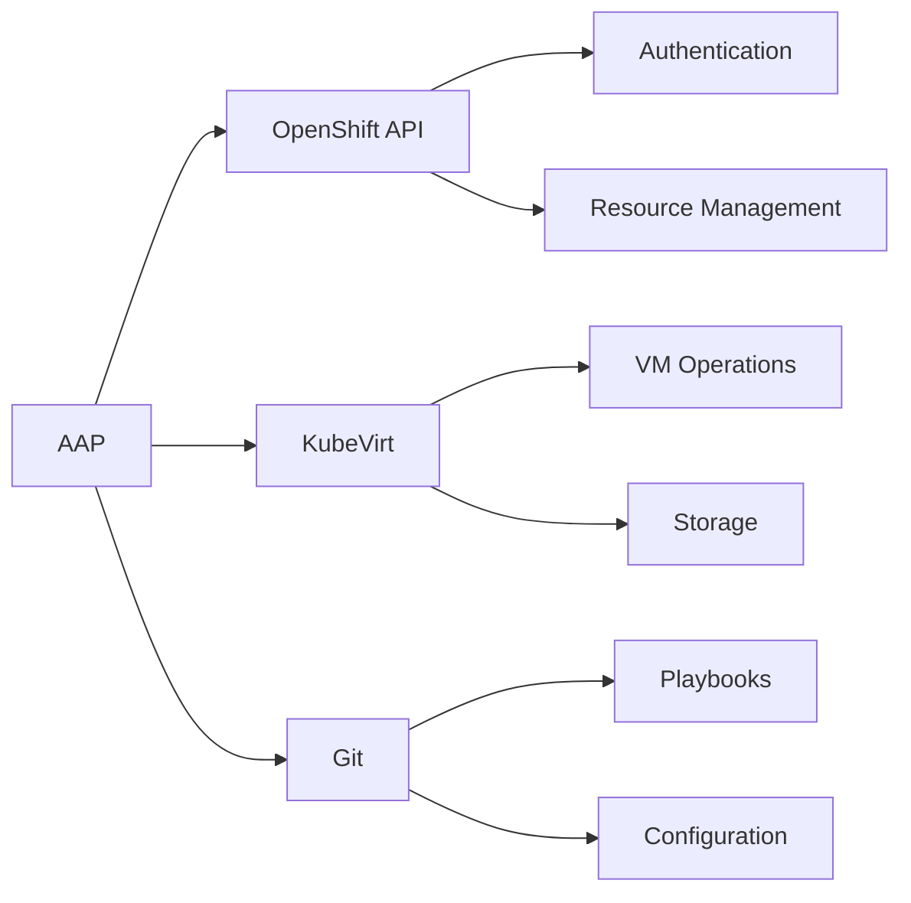
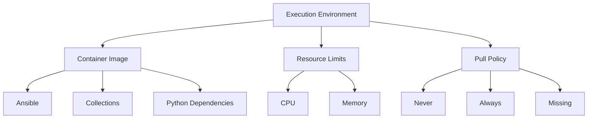

# AAP Architecture Diagrams

## Component Architecture

```mermaid
graph TD
    A[Automation Controller] --> B[Execution Environments]
    A --> C[Automation Hub]
    C --> B
    A --> D[Inventories]
    A --> E[Credentials]
    A --> F[Projects]
    B --> G[Job Execution]
    D --> H[KubeVirt VMs]
    E --> I[OpenShift API]
    F --> J[Git Repository]
```

## VM Management Flow

```mermaid
sequenceDiagram
    participant User
    participant AAP
    participant OpenShift
    participant KubeVirt
    
    User->>AAP: Create VM Request
    AAP->>OpenShift: Authenticate
    OpenShift-->>AAP: Token
    AAP->>KubeVirt: Create VM
    KubeVirt-->>AAP: VM Created
    AAP-->>User: Success
    
    User->>AAP: Start VM
    AAP->>KubeVirt: Start VM
    KubeVirt-->>AAP: VM Running
    AAP-->>User: Success
```

## Integration Points

```mermaid
graph LR
    A[AAP] --> B[OpenShift API]
    A --> C[KubeVirt]
    A --> D[Git]
    B --> E[Authentication]
    B --> F[Resource Management]
    C --> G[VM Operations]
    C --> H[Storage]
    D --> I[Playbooks]
    D --> J[Configuration]
```

## Execution Environment

```mermaid
graph TD
    A[Execution Environment] --> B[Container Image]
    B --> C[Ansible]
    B --> D[Collections]
    B --> E[Python Dependencies]
    A --> F[Resource Limits]
    F --> G[CPU]
    F --> H[Memory]
    A --> I[Pull Policy]
    I --> J[Never]
    I --> K[Always]
    I --> L[Missing]
``` 